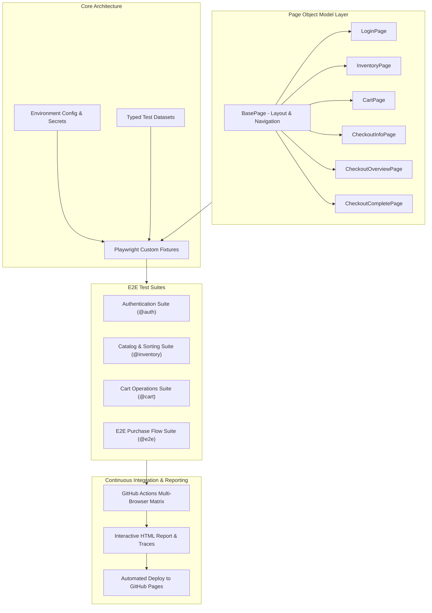

# 🚀 Enterprise QA Automation Portfolio Framework

[](https://github.com/albmarmar6/portfolio/actions/workflows/playwright.yml)
[](https://www.typescriptlang.org/)
[](https://playwright.dev/)
[](https://opensource.org/licenses/MIT)

A scalable, production-grade end-to-end (E2E) testing framework developed with **Playwright**, **TypeScript**, and **Page Object Model (POM)** architecture. Designed following software engineering best practices for high maintainability, zero-flakiness, parallel execution, and automated CI/CD reporting.

---

## 🏗️ Architecture & Design Patterns

The framework applies **Dependency Injection via Custom Fixtures** on top of the **Page Object Model (POM)** to decouple test logic from UI selectors and reduce boilerplate setup.



---

## ✨ Key Engineering Highlights

- **Type Safety**: 100% strict TypeScript types with path aliases (`@pages/*`, `@fixtures/*`, `@data/*`).
- **Resilient Locators**: Selector priority focused on user-facing roles and deterministic `data-test` attributes.
- **Custom Fixtures**: Eliminates repetitive login steps and instantiates Page Objects via `test.extend()`.
- **E2E Mathematical Verification**: Automated validation of dynamic subtotal calculation, tax breakdown, and total cost verification in checkout.
- **Self-Healing & Debuggability**: Full execution trace viewer, failure screenshots, and execution video recordings enabled on failure.
- **CI/CD Integration**: Headless matrix execution on Chromium, Firefox, and WebKit with automated deployment of HTML reports to GitHub Pages.

---

## 🧪 Test Coverage Breakdown

| Suite | Tag | Scenarios Covered |
| :--- | :--- | :--- |
| **Authentication** | `@auth` | Valid login, locked out user handling, invalid credentials, required fields validation, sidebar logout & route protection. |
| **Product Catalog** | `@inventory` | Name sorting (A-Z, Z-A), Price sorting (Low to High, High to Low), catalog completeness, item details navigation. |
| **Shopping Cart** | `@cart` | Badge counter increment/decrement, multi-item addition, item removal from catalog & cart view, cart state persistence. |
| **Checkout E2E** | `@e2e` | Full purchase journey (Catalog -> Cart -> Customer Details -> Overview & Math Check -> Order Confirmation), form validation. |

---

## 🚀 Getting Started

### Prerequisites
- [Node.js](https://nodejs.org/) (v18.x or v20.x recommended)
- `npm` (comes with Node.js)

### Installation

1. Clone the repository:
   ```bash
   git clone https://github.com/albmarmar6/portfolio.git
   cd portfolio
   ```

2. Install dependencies:
   ```bash
   npm install
   ```

3. Install Playwright browser binaries:
   ```bash
   npx playwright install --with-deps
   ```

---

## 💻 Running Tests

### Standard Headless Run (All Browsers in Parallel)
```bash
npm test
```

### Run on Specific Browser (e.g., Chromium)
```bash
npm run test:chromium
```

### Interactive UI Mode (Playwright Time-Travel Debugger)
```bash
npm run test:ui
```

### Headed Mode (Watch Browser Execution)
```bash
npm run test:headed
```

### Run Specific Test Suite by Tag
```bash
npx playwright test --grep @e2e
```

### View Interactive HTML Test Report
```bash
npm run report
```

### Check TypeScript Types
```bash
npm run typecheck
```

---

## 🔄 CI/CD Pipeline (GitHub Actions)

Every pull request and push to `main` triggers `.github/workflows/playwright.yml`:
1. Checks out repository and sets up Node.js.
2. Runs TypeScript type checking (`npm run typecheck`).
3. Executes Playwright test matrix across Chromium, Firefox, and WebKit.
4. Archives test results and generates an interactive Playwright HTML report.
5. Deploys the live report directly to **GitHub Pages**.

---

## 🗺️ Roadmap & Next Milestones

- [x] Phase 1: E2E Automation Framework with Page Object Model on **SauceDemo**.
- [x] Phase 2: Multi-browser parallel execution and GitHub Actions CI/CD with GitHub Pages report deployment.
- [ ] Phase 3: Integration of **Restful Booker Platform** (`automationintesting.online`) featuring **Hybrid UI + REST API Testing** (`playwright.request`), network interception, and mock server validations.
- [ ] Phase 4: Visual regression testing (`toHaveScreenshot()`) for UI consistency verification.

---

## 👤 Author

**Alberto Martín**
- **Role**: QA Engineer / SDET
- **Education**: B.S. in Computer Engineering (University of Seville & AGH Krakow)
- **LinkedIn**: [linkedin.com/in/albertomartin](https://linkedin.com)
- **Email**: albertomartinmartin201@gmail.com
