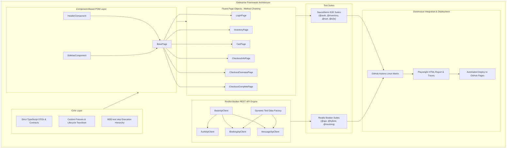

# 🚀 Enterprise QA Automation Portfolio Framework

[](https://github.com/albmarmar6/portfolio/actions/workflows/playwright.yml)
[](https://www.typescriptlang.org/)
[](https://playwright.dev/)
[](https://eslint.org/)
[](https://opensource.org/licenses/MIT)

> **Live Interactive Test Report**: [https://albmarmar6.github.io/portfolio](https://albmarmar6.github.io/portfolio)

A production-grade, multi-target automation framework engineered with **Playwright**, **TypeScript**, **Component-Based Page Object Model (POM)**, and **REST API Clients**. Built according to modern Senior SDET standards for maintainability, zero-flakiness, parallel execution, and automated CI/CD reporting.

---

## 🏛️ High-Level Architecture



---

## 💎 Senior SDET Design Patterns & Engineering Highlights

1. **Component-Based Page Object Model**:
   - Reusable UI elements (`HeaderComponent`, `SidebarComponent`) are composed cleanly into `BasePage` rather than duplicated or bloated into a single monolithic class.
2. **Fluent Page Object Pattern (Method Chaining)**:
   - Page methods return either `this` or the destination `Page Object` (e.g., `loginPage.loginAs(...)` returns `InventoryPage`, `cartPage.proceedToCheckout()` returns `CheckoutInfoPage`), creating a clean, expressive DSL for test scenarios.
3. **BDD-Style Hierarchy with `test.step(...)`**:
   - Every action and assertion is wrapped in structured `test.step` blocks. This produces clean, self-documenting reports showing exact execution milestones and timings.
4. **Zero-Locator Leakage**:
   - Test files never contain raw CSS selectors, XPaths, or inline `page.locator()` calls. All UI interactions are encapsulated inside strongly typed Page Objects.
5. **Full REST API Testing Layer (`playwright.request`)**:
   - Dedicated HTTP clients (`AuthApiClient`, `BookingApiClient`, `MessageApiClient`) with dynamic data factories, status code validation (200, 201, 400), and JSON schema validation.
6. **Network Interception & Fault Injection (`page.route`)**:
   - Intercepts network traffic to simulate server 500 crashes and mock custom backend payloads, validating frontend error handling resiliency.
7. **Automatic Browser Lifecycle & Teardown**:
   - Custom fixtures guarantee that browser instances and contexts are automatically closed cleanly upon test completion.
8. **Automated CI/CD & GitHub Pages Deployment**:
   - Multi-browser headless matrix running in GitHub Actions with automatic deployment of the interactive HTML report to GitHub Pages on every push.

---

## 🧪 Comprehensive Test Coverage Matrix

### 🛒 Application 1: SauceDemo (E-Commerce Platform)

| Suite | Tag | Target Area | Key Scenarios |
| :--- | :--- | :--- | :--- |
| **Auth** | `@auth` | Security & Session | Standard login, locked out user, invalid credentials, required field validations, sidebar logout. |
| **Inventory** | `@inventory` | Catalog & Filters | Alphabetical sorting (A-Z, Z-A), numeric price sorting (Low-to-High, High-to-Low), item details navigation. |
| **Cart** | `@cart` | State & Persistence | Badge count increments/decrements, multi-item removal from catalog and cart view, back-navigation. |
| **Checkout E2E** | `@e2e` | End-to-End Journey | Full purchase flow: Catalog -> Cart -> Customer Details -> Overview & Financial Math Check (`Subtotal + Tax = Total`) -> Confirmation. |

### 🏨 Application 2: Restful Booker Platform (API & Hybrid Testing)

| Suite | Tag | Target Area | Key Scenarios |
| :--- | :--- | :--- | :--- |
| **REST API** | `@api` | Backend Endpoints | Admin token generation (`POST /auth/login`), list bookings (`GET /booking/`), create booking (`POST /booking/`), get booking by ID (`GET /booking/{id}`), contact message (`POST /message/`), negative validation (400 Bad Request). |
| **UI & Hybrid** | `@hybrid` | Cross-Layer Integration | Verify homepage hero & room cards rendering, contact form submission from UI with confirmation verification. |
| **Network Mocking** | `@mocking` | Fault Injection | Mocking HTTP 500 error on `/message/` to verify UI resilience, mocking custom room response on `/room/`. |

---

## 🚀 Quick Start & Local Execution

### Prerequisites
- [Node.js](https://nodejs.org/) (v18.x or v20.x)
- `npm`

### Installation
```bash
# 1. Clone repository
git clone https://github.com/albmarmar6/portfolio.git
cd portfolio

# 2. Install dependencies
npm ci

# 3. Install Playwright browser binaries
npx playwright install --with-deps
```

---

## 💻 NPM Test Scripts

```bash
# Run all test suites (SauceDemo + Restful Booker)
npm test

# Run tests in interactive visual UI mode (Time-Travel Debugger)
npm run test:ui

# Run tests with visible browser (Headed Mode)
npm run test:headed

# Run only SauceDemo tests
npm run test:sauce

# Run only Restful Booker tests
npm run test:booker

# Run only REST API tests
npm run test:api

# Run only E2E purchase tests
npm run test:e2e

# Run only Network Mocking / Fault Injection tests
npm run test:mocking

# Open interactive HTML test report
npm run report

# Run TypeScript type check
npm run typecheck

# Run ESLint linter
npm run lint
```

---

## 🔄 CI/CD Pipeline (GitHub Actions)

Every push or pull request to `main` triggers `.github/workflows/playwright.yml`:
1. Installs project dependencies via `npm ci`.
2. Validates TypeScript types (`npm run typecheck`).
3. Installs Playwright browser binaries and system dependencies.
4. Executes the full test matrix across Chromium, Firefox, and WebKit.
5. Deploys the generated HTML report directly to **GitHub Pages**.

---

## 👤 Author

**Alberto Martín**
- **Role**: QA Engineer / SDET
- **Education**: B.S. in Computer Engineering (University of Seville & AGH Krakow)
- **Email**: albertomartinmartin201@gmail.com
- **LinkedIn**: [linkedin.com](https://linkedin.com)
